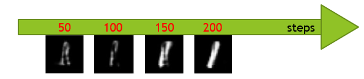

# DDPM Compressed Sensing on MNIST

This repository contains a small implementation of **compressed sensing with a generative neural network prior**.

The project is inspired by the paper:

> Ashish Bora, Ajil Jalal, Eric Price, and Alexandros G. Dimakis,  
> *Compressed Sensing using Generative Models*, ICML.

The main idea is to replace the classical sparsity prior in compressed sensing with a learned generative prior. In this implementation, the generative prior is a **UNet-based DDPM** trained on MNIST-like images.

This repository is an educational/research implementation. It is **not** the official implementation of the paper and does **not** claim to reproduce the full experimental results from the paper.

## Repository Structure

```text
ddpm-compressed-sensing-mnist/
├── README.md
├── main.py
└── figures/
    └── ddpm_reconstruction_progress.png
```

## Project Overview

Compressed sensing studies the recovery of a high-dimensional signal from a small number of measurements.

The standard measurement model is

$$
y = A x + \eta,
$$

where:

- $x \in \mathbb{R}^n$ is the unknown signal,
- $A \in \mathbb{R}^{m \times n}$ is the measurement matrix,
- $y \in \mathbb{R}^m$ is the compressed measurement vector,
- $\eta$ is measurement noise,
- and $m \ll n$.

For an MNIST image,

$$
n = 28 \times 28 = 784.
$$

Instead of observing all 784 pixels, compressed sensing observes only a smaller number of random linear measurements.

The goal is to reconstruct the original image from these compressed measurements.

## Classical Compressed Sensing

In classical compressed sensing, the signal is usually assumed to be sparse in a fixed basis such as DCT, Fourier, or wavelets.

A common recovery formulation is

$$
\min_x \|x\|_1
\quad
\text{subject to}
\quad
\|Ax-y\|_2 \leq \epsilon.
$$

The $\ell_1$ norm promotes sparse solutions and is used as a convex relaxation of the ideal but difficult $\ell_0$ sparse recovery problem.

This classical approach works well when the signal is actually sparse or compressible in a known transform basis.

## Motivation: Beyond Simple Sparsity

Many real-world signals are not simply sparse in pixels or in a fixed transform basis.

Examples include:

- natural images,
- handwritten digits,
- faces,
- audio signals.

These signals have structure, but the structure is often better described by a learned data distribution than by simple sparsity.

This motivates the use of a generative model as a prior.

## Generative Model as a Prior

The key idea of the reference paper is to replace the sparsity assumption with a generative assumption.

Instead of assuming that $x$ is sparse, assume that $x$ lies near the range of a trained generator:

$$
x \approx G(z),
$$

where:

- $z$ is a latent variable,
- $G$ is a trained generative model,
- and $G(z)$ is an image-like signal.

Then the compressed sensing recovery problem becomes

$$
\min_z \|A G(z) - y\|_2^2.
$$

This means that the reconstruction is constrained to look like a realistic sample from the learned data distribution.

In this project, the role of the generative prior is played by a **Denoising Diffusion Probabilistic Model**, or DDPM.

## What I Implemented

The implementation is contained in one file:

```text
main.py
```

The code implements:

| Component | Description |
|---|---|
| `ResidualBlock` | Convolutional residual block used inside the UNet. |
| `AttentionBlock` | Self-attention block for spatial feature interaction. |
| `UNet` | Denoising neural network used inside the DDPM. |
| `DDPM` | Forward noising and reverse denoising diffusion model. |
| `generate_random_matrix` | Generates a random Gaussian compressed sensing matrix. |
| `l1_recovery` | Implements an $\ell_1$ recovery baseline using ISTA. |
| `evaluate_recovery` | Computes PSNR and SSIM if evaluation results are generated. |
| `plot_comparison` | Plots original, L1-recovered, and DDPM-recovered images. |
| `plot_progress` | Visualizes the DDPM reconstruction process. |
| `train_ddpm` | Trains the DDPM model on MNIST. |
| `main` | Runs training or compressed sensing recovery from command-line arguments. |

## Implemented Recovery Methods

### 1. Random Gaussian Measurements

The code generates a random Gaussian measurement matrix:

$$
A_{ij} \sim \mathcal{N}(0, 1/m).
$$

The compressed measurement vector is computed as

$$
y = Ax.
$$

This is the compressed sensing measurement step.

### 2. L1 Recovery with ISTA

The classical baseline solves the regularized problem

$$
\min_x
\frac{1}{2}\|Ax-y\|_2^2
+
\lambda \|x\|_1.
$$

The implementation uses the Iterative Soft Thresholding Algorithm, or ISTA.

Each iteration performs:

1. a gradient step on the measurement error,
2. a soft-thresholding step for the $\ell_1$ penalty,
3. a convergence check.

This gives a standard sparse recovery baseline.

### 3. DDPM Generative Recovery

The DDPM is trained to denoise MNIST images.

During training, noise is added to a clean image:

$$
x_t =
\sqrt{\bar{\alpha}_t}x_0
+
\sqrt{1-\bar{\alpha}_t}\epsilon.
$$

The UNet learns to predict the noise $\epsilon$ from the noisy image $x_t$.

During compressed sensing recovery, the model starts from noise and gradually denoises it. At each reverse diffusion step, the reconstruction is also pushed toward measurement consistency.

The measurement error is

$$
A\hat{x}_0 - y.
$$

A gradient correction is applied so that the generated image both:

1. looks like an MNIST digit,
2. matches the compressed measurements.

## Result Visualization

The only result visualization currently included in this repository is the DDPM reconstruction progress image.

<p align="center">
  
</p>

**Figure 1.** Visualization of the DDPM reconstruction process. The image shows intermediate reconstructed estimates at several reverse diffusion steps. The reconstruction gradually becomes more digit-like as the DDPM denoising process progresses.

## What This Visualization Shows

The figure illustrates the main idea of diffusion-based compressed sensing recovery.

The model starts from a noisy or weakly structured estimate and gradually moves toward a cleaner digit-like reconstruction. The DDPM prior helps guide the reconstruction toward the learned MNIST data distribution.

This is a qualitative visualization only. This repository currently does not include a full quantitative benchmark, PSNR/SSIM table, or comparison against the original paper results.

## Why the Paper Is a Landmark

The reference paper is important because it helped introduce a new way of thinking about compressed sensing and inverse problems.

### Novel Prior

The paper proposed using deep generative models as structured priors for inverse problems.

Instead of assuming that signals are sparse in a fixed basis, the paper assumes that signals lie near the range of a trained generator:

$$
x \approx G(z).
$$

This was a major conceptual shift from hand-designed priors to learned priors.

### Theoretical Framework

The paper provided theoretical guarantees for compressed sensing with neural network priors.

The key idea is that if the measurement matrix behaves well on the range of the generator, then recovery can be stable. This is related to restricted isometry ideas, sometimes described in this context through set-restricted or weighted restricted isometry conditions.

The important message is that the number of measurements depends on the complexity of the generative model and latent space, rather than only on classical sparsity.

### Practical Algorithm

The paper introduced a simple practical recovery strategy:

$$
\min_z \|A G(z) - y\|_2^2.
$$

This can be optimized with gradient descent in the latent space of the generator.

In my implementation, the generative model is a DDPM rather than a GAN or VAE, so the recovery is implemented through measurement-guided diffusion sampling rather than direct latent optimization.

### Paradigm Shift

The paper opened the door to using learned generative models for many inverse problems, including:

- compressed sensing,
- denoising,
- super-resolution,
- inpainting,
- image reconstruction from partial measurements.

The measurement matrix $A$ defines the observation process, and the generative model provides the learned prior used to reconstruct the signal.

## Limitations and Subsequent Research

### Domain Specificity

The generator must be trained on data similar to the signals being recovered.

For example, a generator trained on MNIST digits is useful for MNIST-like images, but it should not be expected to reconstruct arbitrary natural images well.

### Approximation Error

Performance is limited by how well the generator can represent the true signal.

If the true signal is not close to the range of the generator, then even the best latent code may produce a poor reconstruction.

In other words, recovery is capped by the approximation quality of

$$
G(z) \approx x.
$$

### Optimization Difficulty

The recovery problem is generally non-convex:

$$
\min_z \|A G(z) - y\|_2^2.
$$

Because $G$ is a neural network, the loss landscape may contain bad local minima. Different initializations or optimization settings can lead to different reconstructions.

For diffusion models, the sampling and measurement guidance process also depends on hyperparameters such as measurement weight, noise schedule, and number of reverse steps.

## How to Run

Install the required packages:

```bash
pip install torch torchvision matplotlib scikit-image numpy
```

Train the DDPM model:

```bash
python main.py --train --epochs 10
```

Run compressed sensing reconstruction:

```bash
python main.py --measurement_ratio 0.1 --num_samples 5
```

Run on CPU only:

```bash
python main.py --no_cuda --measurement_ratio 0.1 --num_samples 5
```

## Requirements

```text
torch
torchvision
numpy
matplotlib
scikit-image
```

## Key Takeaways

<div align="center">

<table>
  <tr>
    <th>Concept</th>
    <th>Main Takeaway</th>
  </tr>
  <tr>
    <td><b>Compressed sensing</b></td>
    <td>The image is reconstructed from fewer random linear measurements than its full pixel dimension.</td>
  </tr>
  <tr>
    <td><b>Classical prior</b></td>
    <td>L1 recovery assumes sparsity and is implemented using ISTA.</td>
  </tr>
  <tr>
    <td><b>Generative prior</b></td>
    <td>The DDPM acts as a learned image prior that encourages digit-like reconstructions.</td>
  </tr>
  <tr>
    <td><b>Measurement guidance</b></td>
    <td>The diffusion reconstruction is corrected using the compressed sensing measurement error.</td>
  </tr>
  <tr>
    <td><b>Main limitation</b></td>
    <td>The method works best when the generator is trained on data similar to the target signal.</td>
  </tr>
</table>

</div>

## Reference

This project is inspired by:

```text
Ashish Bora, Ajil Jalal, Eric Price, and Alexandros G. Dimakis.
Compressed Sensing using Generative Models.
International Conference on Machine Learning.
```

This repository is an independent educational implementation and is not the official implementation of the paper.

## License

MIT